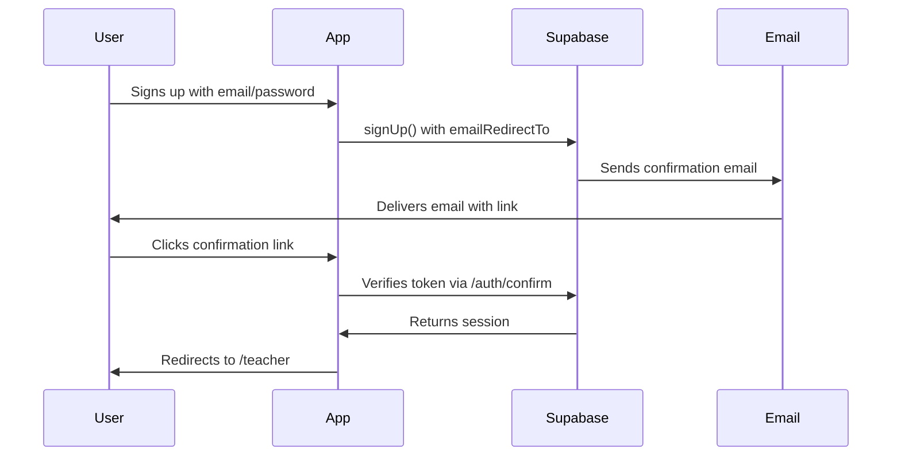

# Email Confirmation Setup Guide

This guide explains how to configure Supabase email templates to work correctly with your Quizzy application.

## The Problem

When users sign up, Supabase sends a confirmation email. By default, this email contains a link that goes directly to Supabase's servers, which then redirects back to your app. However, this can lead to "unknown page" errors if not configured correctly.

## The Solution

Configure the Supabase email template to point directly to your app's `/auth/confirm` endpoint, which handles the verification and redirects users appropriately.

## Step-by-Step Configuration

### 1. Access Supabase Dashboard

1. Go to [Supabase Dashboard](https://supabase.com/dashboard)
2. Select your project: `bgotkjqweuzdcvspbcxb`
3. Navigate to **Authentication** → **Email Templates**

### 2. Update the "Confirm signup" Template

Find the **"Confirm signup"** template and update it with the following:

#### Subject Line
```
Confirm Your Signup
```

#### Email Content (HTML)
```html
<h2>Confirm your signup</h2>

<p>Follow this link to confirm your user:</p>
<p><a href="{{ .SiteURL }}/auth/confirm?token_hash={{ .TokenHash }}&type=signup&next=/teacher">Confirm your email</a></p>

<p>If you didn't request this email, you can safely ignore it.</p>
```

**Important Notes:**
- `{{ .SiteURL }}` - Your app's URL (configured in Auth settings)
- `{{ .TokenHash }}` - The secure token for verification
- `type=signup` - Tells the app this is a signup confirmation
- `next=/teacher` - Where to redirect after successful confirmation

### 3. Configure Site URL

1. In Supabase Dashboard, go to **Authentication** → **URL Configuration**
2. Set your **Site URL**:
   - **Local Development**: `http://localhost:3000`
   - **Production**: Your actual domain (e.g., `https://quizzy.com`)

### 4. Add Redirect URLs to Allow List

Add these URLs to the **Redirect URLs** allow list:

**For Local Development:**
```
http://localhost:3000/**
```

**For Production:**
```
https://yourdomain.com/**
https://*.yourdomain.com/**
```

The `**` wildcard allows all paths under your domain.

### 5. Test the Configuration

1. Sign up with a new email address
2. Check your email inbox
3. Click the confirmation link
4. You should be redirected to `/teacher` after successful confirmation

## How It Works



## Troubleshooting

### "Invalid confirmation link" Error

**Cause**: The token has expired or is invalid.

**Solution**: 
- Tokens expire after 24 hours by default
- Request a new confirmation email
- Check that the email template is configured correctly

### "Unknown page" Error

**Cause**: The confirmation link is going to the wrong URL.

**Solution**:
- Verify the email template uses `{{ .SiteURL }}/auth/confirm`
- Check that your Site URL is configured correctly
- Ensure `/auth/confirm` is in your redirect URLs allow list

### Email Not Received

**Cause**: Email provider issues or rate limiting.

**Solution**:
- Check spam folder
- Wait a few minutes (rate limit: 1 email per 60 seconds)
- Verify email address is correct
- Check Supabase logs for delivery errors

### Redirect Loop

**Cause**: Middleware or authentication logic issues.

**Solution**:
- Check `middleware.ts` configuration
- Verify `/auth/confirm` is excluded from auth checks
- Review server logs for errors

## Email Template Variables

Available variables you can use in email templates:

| Variable | Description | Example |
|----------|-------------|---------|
| `{{ .SiteURL }}` | Your app's configured Site URL | `http://localhost:3000` |
| `{{ .TokenHash }}` | Hashed verification token | `abc123...` |
| `{{ .Token }}` | 6-digit OTP (alternative to link) | `123456` |
| `{{ .Email }}` | User's email address | `user@example.com` |
| `{{ .RedirectTo }}` | Custom redirect URL from signUp | `/teacher` |

## Alternative: Using OTP Instead of Links

If you prefer to use a 6-digit code instead of a link:

```html
<h2>Confirm your signup</h2>

<p>Enter this code to confirm your email:</p>
<h1 style="font-size: 32px; letter-spacing: 8px;">{{ .Token }}</h1>

<p>This code expires in 24 hours.</p>
```

Then update your app to accept OTP codes on a confirmation page.

## Production Deployment

When deploying to production:

1. Update Site URL to your production domain
2. Add production domain to redirect URLs allow list
3. Test the entire signup flow in production
4. Monitor Supabase logs for any issues

## Security Considerations

- Never expose `{{ .TokenHash }}` in client-side code
- Always use HTTPS in production
- Keep token expiry times reasonable (default: 24 hours)
- Implement rate limiting on signup endpoints
- Monitor for suspicious signup patterns

## Additional Resources

- [Supabase Email Templates Documentation](https://supabase.com/docs/guides/auth/auth-email-templates)
- [Supabase Redirect URLs Guide](https://supabase.com/docs/guides/auth/redirect-urls)
- [Next.js Authentication Guide](https://nextjs.org/docs/authentication)
