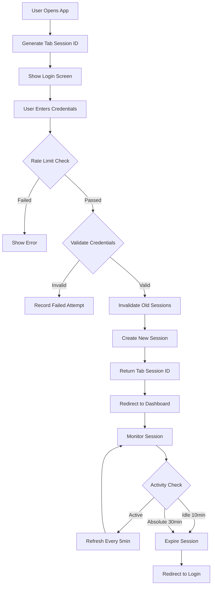
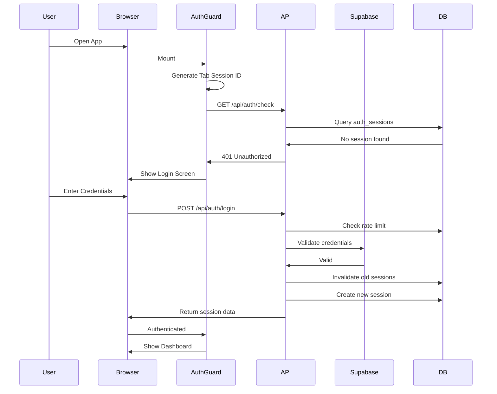
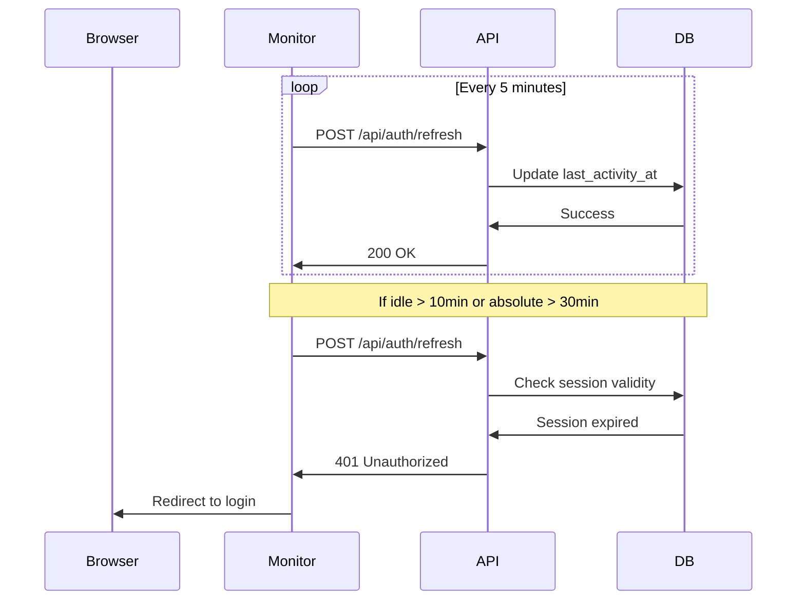

# Security Architecture Documentation

## Overview

This document describes the comprehensive security architecture implemented for VocabArena, focusing on authentication, session management, and security hardening for teacher accounts while maintaining anonymous access for students via game links.

## Table of Contents

1. [Authentication System](#authentication-system)
2. [Session Management](#session-management)
3. [Security Hardening](#security-hardening)
4. [Role-Based Access Control](#role-based-access-control)
5. [API Security](#api-security)
6. [Database Schema](#database-schema)
7. [Testing & Validation](#testing--validation)

---

## Authentication System

### Overview

- **Teachers**: Full authentication required with tab-scoped sessions
- **Students**: Anonymous access via shareable game links (no authentication)
- **No persistent auth**: Session cookies only, no localStorage/IndexedDB
- **Force fresh login**: Every new tab/visit requires authentication

### Key Features

#### 1. Tab-Scoped Sessions

Each browser tab has a unique session ID stored only in memory:

```typescript
// Generated on tab load
const tabSessionId = generateClientTabSessionId(); // 64-char hex string

// Sent with every authenticated request
headers: {
  'X-Tab-Session': tabSessionId
}
```

**Benefits:**
- Opening a new tab requires a new login
- No session sharing across tabs
- Prevents session hijacking across tabs

#### 2. Session Timeouts

- **Absolute timeout**: 30 minutes from login
- **Idle timeout**: 10 minutes of inactivity
- **Automatic refresh**: Every 5 minutes via background ping

#### 3. Single Active Session

- Only one active session per user at a time
- New login invalidates all previous sessions
- Prevents concurrent logins

---

## Session Management

### Database Tables

#### `auth_sessions`

Stores active session information:

```sql
CREATE TABLE auth_sessions (
  id UUID PRIMARY KEY,
  user_id UUID REFERENCES auth.users(id),
  tab_session_id TEXT UNIQUE NOT NULL,
  user_agent TEXT,
  ip_address TEXT,
  created_at TIMESTAMPTZ NOT NULL,
  last_activity_at TIMESTAMPTZ NOT NULL,
  expires_at TIMESTAMPTZ NOT NULL,
  invalidated_at TIMESTAMPTZ
);
```

### Session Lifecycle



### Session Validation Flow

Every authenticated request:

1. Extract `X-Tab-Session` header
2. Query `auth_sessions` table
3. Check if session is invalidated
4. Validate absolute timeout (30min)
5. Validate idle timeout (10min)
6. Update `last_activity_at`
7. Return user data or 401

---

## Security Hardening

### 1. Transport Security

#### HTTPS Enforcement

```typescript
// Production only
headers: {
  'Strict-Transport-Security': 'max-age=31536000; includeSubDomains'
}
```

### 2. Content Security Policy (CSP)

```typescript
const csp = [
  "default-src 'self'",
  "script-src 'self' 'unsafe-inline' 'unsafe-eval'", // Next.js requirement
  "style-src 'self' 'unsafe-inline'",
  "img-src 'self' data: https:",
  "font-src 'self' data:",
  "connect-src 'self' https://*.supabase.co",
  "frame-ancestors 'none'",
  "base-uri 'self'",
  "object-src 'none'"
].join('; ');
```

### 3. Security Headers

All responses include:

```typescript
{
  'X-Frame-Options': 'DENY',
  'X-Content-Type-Options': 'nosniff',
  'Referrer-Policy': 'strict-origin-when-cross-origin',
  'X-XSS-Protection': '1; mode=block',
  'Permissions-Policy': 'camera=(), microphone=(), geolocation=()',
  'Cache-Control': 'no-store, no-cache, must-revalidate, private' // Authenticated pages
}
```

### 4. Rate Limiting

#### Login Attempts

- **Max attempts**: 5 per 5 minutes (per IP and email)
- **Tracking**: `login_attempts` table
- **Backoff delays**: 1m, 2m, 5m, 15m, 30m
- **CAPTCHA threshold**: After 3 failed attempts (optional)

```typescript
const rateLimit = await checkLoginRateLimit(email, ipAddress);
if (!rateLimit.allowed) {
  return 429; // Too Many Requests
}
```

### 5. CSRF Protection

- Token generated on login
- Validated on state-changing operations
- Constant-time comparison to prevent timing attacks

### 6. Password Security

- **Hashing**: Supabase uses bcrypt (cost factor 10+)
- **Policy**: Minimum 12 characters, complexity requirements
- **Storage**: Never stored in plaintext

---

## Role-Based Access Control

### User Roles

```typescript
type UserRole = 'super_admin' | 'teacher';
```

### Role Enforcement

#### Server-Side

```typescript
// Require authentication
const user = await requireAuth();

// Require specific role
const user = await requireRole(['teacher', 'super_admin']);
```

#### Middleware

```typescript
// Protected routes automatically enforce authentication
const protectedPaths = ['/teacher', '/protected'];
```

### Access Matrix

| Route | Public | Teacher | Admin |
|-------|--------|---------|-------|
| `/` | ✅ | ✅ | ✅ |
| `/auth/*` | ✅ | ✅ | ✅ |
| `/game/*` | ✅ | ✅ | ✅ |
| `/teacher` | ❌ | ✅ | ✅ |
| `/protected` | ❌ | ✅ | ✅ |

---

## API Security

### Authentication Endpoints

#### POST `/api/auth/login`

**Request:**
```json
{
  "email": "teacher@example.com",
  "password": "securepassword",
  "tabSessionId": "abc123..."
}
```

**Response (Success):**
```json
{
  "success": true,
  "tabSessionId": "abc123...",
  "csrfToken": "xyz789...",
  "expiresAt": "2024-01-01T12:30:00Z",
  "user": {
    "id": "uuid",
    "email": "teacher@example.com"
  }
}
```

**Response (Rate Limited):**
```json
{
  "error": "Too many login attempts",
  "remainingAttempts": 0,
  "resetAt": "2024-01-01T12:05:00Z",
  "requiresCaptcha": true
}
```

#### POST `/api/auth/logout`

**Headers:**
```
X-Tab-Session: abc123...
```

**Response:**
```json
{
  "success": true
}
```

#### GET `/api/auth/check`

**Headers:**
```
X-Tab-Session: abc123...
```

**Response:**
```json
{
  "authenticated": true,
  "user": {
    "id": "uuid",
    "email": "teacher@example.com",
    "role": "teacher",
    "passwordChangeRequired": false
  },
  "session": {
    "expiresAt": "2024-01-01T12:30:00Z",
    "lastActivityAt": "2024-01-01T12:15:00Z"
  }
}
```

#### POST `/api/auth/refresh`

**Headers:**
```
X-Tab-Session: abc123...
```

**Response:**
```json
{
  "success": true
}
```

---

## Database Schema

### Security Tables

#### `auth_sessions`
- Stores active sessions with tab-scoped IDs
- Tracks IP, user agent, timestamps
- Supports session invalidation

#### `login_attempts`
- Records all login attempts (success/failure)
- Enables rate limiting
- Auto-cleanup after 7 days

#### `audit_logs`
- Comprehensive security event logging
- Tracks: logins, logouts, access denials, admin actions
- Retention: 90 days

### RLS Policies

All security tables use Row Level Security:

```sql
-- Only service role can access
CREATE POLICY "Service role only" ON auth_sessions
  FOR ALL
  USING (auth.role() = 'service_role');
```

---

## Testing & Validation

### Security Test Checklist

#### Authentication Tests

- [ ] Opening new tab requires new login
- [ ] Session expires after 30 minutes (absolute)
- [ ] Session expires after 10 minutes (idle)
- [ ] Logout invalidates session immediately
- [ ] Cannot reuse invalidated session
- [ ] Tab session ID mismatch returns 401

#### Rate Limiting Tests

- [ ] 5 failed logins block further attempts
- [ ] Rate limit resets after 5 minutes
- [ ] Successful login resets failed attempt counter
- [ ] Rate limit applies per IP and email

#### Security Headers Tests

- [ ] All security headers present in responses
- [ ] CSP blocks unauthorized resources
- [ ] HSTS enforced in production
- [ ] Cache-Control prevents caching of auth pages

#### Role-Based Access Tests

- [ ] Unauthenticated users redirected to login
- [ ] Teachers can access teacher dashboard
- [ ] Non-teachers cannot access teacher routes
- [ ] Role validation works server-side

#### Session Monitoring Tests

- [ ] Background refresh keeps session alive
- [ ] Session expiry shows clear message
- [ ] Expired session redirects to login
- [ ] Multiple tabs don't share sessions

### Manual Testing Procedure

1. **Fresh Login Test**
   - Open app in new tab
   - Verify login screen shows
   - Login with valid credentials
   - Verify redirect to dashboard

2. **Tab Isolation Test**
   - Login in Tab A
   - Open Tab B
   - Verify Tab B requires new login
   - Login in Tab B
   - Verify Tab A session still works

3. **Timeout Test**
   - Login and wait 10 minutes (idle)
   - Try to access protected route
   - Verify redirect to login with message

4. **Rate Limit Test**
   - Attempt 5 failed logins
   - Verify 6th attempt is blocked
   - Wait 5 minutes
   - Verify can attempt again

---

## Security Best Practices

### For Developers

1. **Never store auth state in localStorage/IndexedDB**
2. **Always use `requireAuth()` for protected routes**
3. **Include `X-Tab-Session` header in authenticated requests**
4. **Validate CSRF tokens on state-changing operations**
5. **Log security events to audit log**
6. **Use parameterized queries (Supabase handles this)**
7. **Never trust client-side data**

### For Deployment

1. **Enable HTTPS** (required for security headers)
2. **Configure Supabase password policy**
3. **Set up automated session cleanup** (cron job)
4. **Monitor audit logs** for suspicious activity
5. **Regular security audits**
6. **Keep dependencies updated**

---

## Architecture Diagrams

### Authentication Flow



### Session Monitoring



---

## Maintenance

### Automated Cleanup

Run these functions periodically (e.g., daily cron job):

```sql
-- Clean up expired sessions
SELECT cleanup_expired_sessions();

-- Clean up old login attempts (>7 days)
SELECT cleanup_old_login_attempts();

-- Clean up old audit logs (>90 days)
SELECT cleanup_old_audit_logs();
```

### Monitoring Queries

```sql
-- Active sessions count
SELECT COUNT(*) FROM auth_sessions 
WHERE invalidated_at IS NULL 
AND expires_at > NOW();

-- Failed login attempts (last hour)
SELECT COUNT(*) FROM login_attempts 
WHERE success = false 
AND attempted_at > NOW() - INTERVAL '1 hour';

-- Recent security events
SELECT * FROM audit_logs 
WHERE created_at > NOW() - INTERVAL '24 hours'
ORDER BY created_at DESC;
```

---

## Support & Contact

For security concerns or questions:
- Review this documentation
- Check audit logs for suspicious activity
- Consult Supabase security documentation
- Follow OWASP security guidelines

---

**Last Updated**: 2024-01-01  
**Version**: 1.0.0
