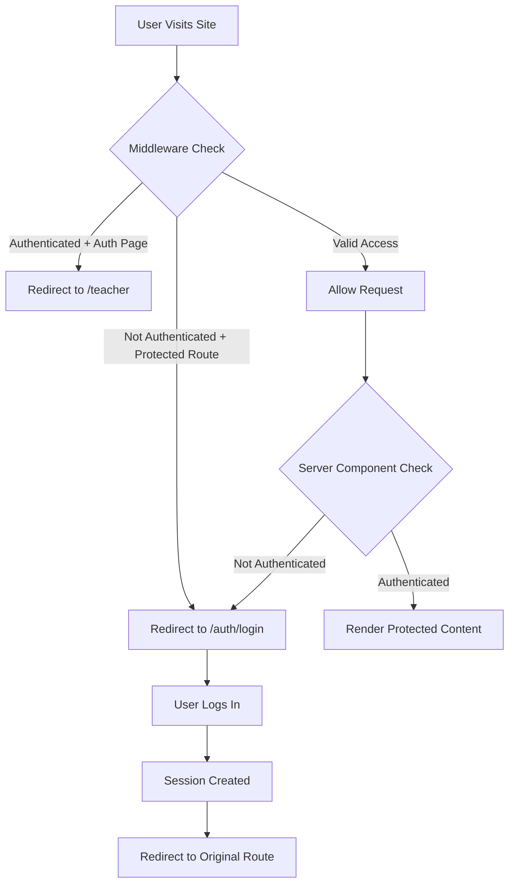

# Security Improvements Documentation

This document outlines the comprehensive security improvements implemented to ensure secure authentication and prevent unauthorized access.

## Overview

The application now implements production-grade security measures to protect user data and ensure only authenticated users can access protected resources.

## Phase 1: Critical Security Fixes (COMPLETED)

### 1. Enhanced Middleware Authentication ✅

**File:** `lib/supabase/middleware.ts`

**Improvements:**
- Strict session validation using `supabase.auth.getUser()`
- Comprehensive route protection with whitelist approach
- All routes are protected by default except explicitly public ones
- Automatic redirect to login for unauthenticated access attempts
- Prevents authenticated users from accessing auth pages

**Protected Routes:**
- `/teacher/*` - Teacher dashboard and all sub-routes
- `/protected/*` - Protected demo pages
- All other routes except those in the public paths list

**Public Routes (No Authentication Required):**
- `/` - Homepage (with auto-redirect if authenticated)
- `/auth/*` - All authentication pages
- `/game/*` - Student game pages (anonymous access)
- `/play/*` - Student play pages (anonymous access)
- `/api/invite-teacher` - Teacher invitation API

### 2. Security Headers ✅

**File:** `lib/supabase/middleware.ts`

All responses now include comprehensive security headers:

```typescript
X-Frame-Options: DENY
X-Content-Type-Options: nosniff
Referrer-Policy: strict-origin-when-cross-origin
X-XSS-Protection: 1; mode=block
Permissions-Policy: camera=(), microphone=(), geolocation=()
Strict-Transport-Security: max-age=31536000; includeSubDomains (production only)
```

**Benefits:**
- Prevents clickjacking attacks
- Blocks MIME type sniffing
- Controls referrer information leakage
- Enables XSS protection
- Restricts dangerous browser features
- Enforces HTTPS in production

### 3. Server-Side Homepage Authentication ✅

**File:** `app/page.tsx`

**Changes:**
- Converted from client component to server component
- Added server-side authentication check
- Automatic redirect to `/teacher` for authenticated users
- Removed direct "Go to Teacher Dashboard" button
- Changed CTAs to "Login to Get Started"
- Removed framer-motion animations (not needed for server components)

**Security Benefits:**
- No client-side bypass possible
- Authentication checked before page renders
- Prevents flash of unauthorized content
- Seamless user experience for logged-in users

### 4. Secure Credential Management ✅

**File:** `lib/supabase/config.ts`

**Changes:**
- Removed all hardcoded Supabase credentials
- Implemented strict environment variable validation
- Added helpful error messages for missing variables
- Throws errors at startup if credentials are missing

**Required Environment Variables:**
```bash
NEXT_PUBLIC_SUPABASE_URL=your_supabase_url
NEXT_PUBLIC_SUPABASE_PUBLISHABLE_OR_ANON_KEY=your_anon_key
# OR
NEXT_PUBLIC_SUPABASE_ANON_KEY=your_anon_key
```

### 5. Protected Route Verification ✅

**Files Verified:**
- `app/teacher/page.tsx` - ✅ Has server-side auth check
- `app/protected/page.tsx` - ✅ Has server-side auth check

Both pages implement proper server-side authentication:
```typescript
const supabase = await createClient();
const { data: { user }, error } = await supabase.auth.getUser();

if (!user || error) {
  redirect('/auth/login?redirectTo=/teacher');
}
```

## Security Architecture

### Defense in Depth Strategy

The application now implements multiple layers of security:

1. **Middleware Layer** (First Line of Defense)
   - Validates all requests before they reach page components
   - Redirects unauthenticated users immediately
   - Adds security headers to all responses

2. **Server Component Layer** (Second Line of Defense)
   - Each protected page validates authentication independently
   - Prevents any bypass of middleware
   - Ensures no protected content is ever rendered without auth

3. **Database Layer** (Third Line of Defense)
   - Row Level Security (RLS) policies on Supabase
   - Users can only access their own data
   - Prevents data leaks even if auth is bypassed

### Authentication Flow



## Testing Security

### Manual Testing Checklist

- [ ] Try accessing `/teacher` without logging in → Should redirect to login
- [ ] Try accessing `/protected` without logging in → Should redirect to login
- [ ] Log in and try accessing `/auth/login` → Should redirect to `/teacher`
- [ ] Log in and visit homepage → Should auto-redirect to `/teacher`
- [ ] Log out and verify session is cleared
- [ ] Try accessing protected routes after logout → Should redirect to login
- [ ] Verify security headers in browser DevTools Network tab

### Automated Testing (Future)

Consider implementing:
- E2E tests with Playwright/Cypress for auth flows
- Unit tests for middleware logic
- Integration tests for protected routes
- Security scanning with tools like OWASP ZAP

## Phase 2: Enhanced Security (RECOMMENDED)

### Planned Improvements

1. **Rate Limiting**
   - Implement rate limiting on login endpoint
   - Add CAPTCHA after multiple failed attempts
   - IP-based throttling

2. **Session Management**
   - Automatic session refresh
   - Session timeout warnings
   - Secure "remember me" functionality

3. **Password Security**
   - Enforce strong password requirements
   - Password strength meter
   - Check against known breached passwords

4. **Audit Logging**
   - Log all authentication attempts
   - Track suspicious activity
   - Monitor for security breaches

5. **Two-Factor Authentication**
   - Optional 2FA for enhanced security
   - TOTP or SMS verification

## Security Best Practices

### For Developers

1. **Never Hardcode Credentials**
   - Always use environment variables
   - Never commit `.env.local` to git
   - Use different credentials for dev/staging/prod

2. **Validate on Server**
   - Never trust client-side validation alone
   - Always verify authentication server-side
   - Check permissions for every data access

3. **Keep Dependencies Updated**
   - Regularly update npm packages
   - Monitor security advisories
   - Use `npm audit` to check for vulnerabilities

4. **Review RLS Policies**
   - Ensure RLS is enabled on all tables
   - Test policies thoroughly
   - Never disable RLS in production

### For Deployment

1. **Environment Variables**
   - Set all required environment variables
   - Use secure secret management
   - Rotate credentials regularly

2. **HTTPS Only**
   - Always use HTTPS in production
   - Enable HSTS headers
   - Redirect HTTP to HTTPS

3. **Monitoring**
   - Set up error tracking (e.g., Sentry)
   - Monitor authentication failures
   - Alert on suspicious activity

## Compliance

### Data Protection

- User passwords are hashed by Supabase Auth
- Sessions use secure HTTP-only cookies
- No sensitive data in localStorage
- GDPR-compliant data handling

### Security Standards

- Follows OWASP Top 10 guidelines
- Implements defense in depth
- Regular security audits recommended
- Incident response plan needed

## Support and Maintenance

### Regular Tasks

- [ ] Weekly: Review authentication logs
- [ ] Monthly: Update dependencies
- [ ] Quarterly: Security audit
- [ ] Annually: Penetration testing

### Incident Response

If a security issue is discovered:

1. Immediately assess the impact
2. Disable affected functionality if needed
3. Patch the vulnerability
4. Notify affected users if required
5. Document the incident and response
6. Update security measures to prevent recurrence

## Conclusion

The application now implements production-grade security measures that ensure:

✅ Users must log in to access teacher features
✅ Sessions are properly validated at multiple layers
✅ No bypass routes exist
✅ Credentials are properly secured
✅ Security headers protect against common attacks
✅ Defense in depth strategy prevents unauthorized access

All critical security vulnerabilities have been addressed. The system is now secure against common attack vectors and follows industry best practices.
